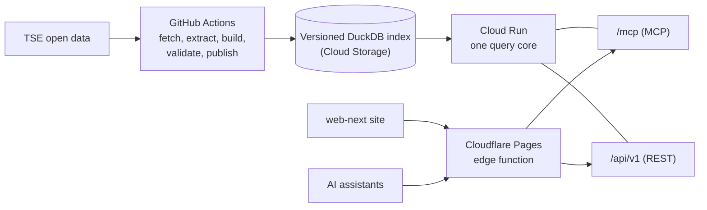

# O meu voto

Answers to the questions a Brazilian voter asks before election day, from the open data of the
Tribunal Superior Eleitoral (TSE), the electoral court: compare candidates side by side, find a
polling place, check the election date. One query core serves them through an MCP server for AI
assistants, a public REST API and a web page, without touching anyone's personal registration
data.

- **Site:** <https://omeuvoto.pages.dev>
- **MCP server:** `https://omeuvoto.pages.dev/mcp` (Streamable HTTP, no sign-in)

**Para eleitores:** compare candidaturas e encontre seu local de votação em
<https://omeuvoto.pages.dev>, ou peça ao seu assistente de IA com a frase abaixo.

<!-- GIF placeholder: a 20-second recording of a question in Claude answered with its TSE source. -->

## Contents

- [Try it in 30 seconds](#try-it-in-30-seconds)
- [What it answers](#what-it-answers)
- [The server is the only source of truth](#the-server-is-the-only-source-of-truth)
- [Architecture](#architecture)
- [Data and privacy](#data-and-privacy)
- [How it was built](#how-it-was-built)
- [Run locally](#run-locally)
- [License and data attribution](#license-and-data-attribution)

## Try it in 30 seconds

In ChatGPT, Claude or another chat assistant, paste:

> Fetch and follow the instructions at omeuvoto.pages.dev/prompt-llm to set up O meu voto in this assistant.

The [setup instructions](https://omeuvoto.pages.dev/prompt-llm) (in Portuguese, for the voter)
open with a short menu, then cover MCP agents, chat apps with custom connectors and a public
REST fallback for chats without a connector. Their source is
[`web-next/public/prompt-llm.md`](web-next/public/prompt-llm.md).

In Claude Code:

```sh
claude mcp add --transport http --scope project o-meu-voto https://omeuvoto.pages.dev/mcp
```

Then ask, for example, "Quem são os candidatos a senador em SP?" or "Compare os candidatos 180 e
400 a senador em SP".

## What it answers

- **Candidate comparison:** 2 to 4 candidacies of the same office, state and round, side by
  side: party or alliance, ticket, registration status, whether votes for them will count, and
  total declared assets. Always in ballot-number order; it never ranks, scores or recommends.
- **Candidates** by office, name or ballot number: ballot name, party, federation, coalition,
  status, occupation, gender as the TSE publishes it, and the official photo.
- **Where do I vote?** The state, zone and section printed on the voter's title become the
  polling place address, with a warning when the place changed or the section votes at another
  one.
- **Polling places by city and neighborhood**, for voters who do not know their section.
- **Election date and voting hours**, from the official electoral calendar.

## The server is the only source of truth

An LLM is good at conversation and bad at facts it cannot check. Here the language model only
converses; every fact comes from the server. The service runs no model: `core` is deterministic
code over an index built from the TSE files, tested without a network. Each answer carries the
TSE dataset, file and generation timestamp it came from, the warnings that apply (stale data, a
changed polling place, a round not yet published) and, when nothing matches, a reason instead of
a guess. The setup text tells the assistant to answer only with what a tool or the API returned
in the conversation, to cite that source, and never to fill a missing field from memory or a web
search.

## Architecture



A scheduled pipeline downloads the TSE files several times a day, on the cadence the TSE
declares, and publishes one read-only DuckDB file with a manifest. A single Python service on
Cloud Run loads it, swaps in new versions without a restart, and exposes the same core through
MCP and REST. Cloudflare Pages serves the site and proxies the API and MCP on the same domain.
Details, the refresh cadence and a one-line summary of every architecture decision:
[`docs/architecture.md`](docs/architecture.md).

## Data and privacy

**What it never answers.** Anything that depends on the individual voter registration: zone and
section from a name or CPF, the status of a voter's title, justifications or debts. Those
questions are redirected to the official e-Título app and TSE self-service. The site never asks
for a CPF or a voter title number.

**Candidate data is minimized at build time.** Original TSE ZIPs and CSVs exist only in the
refresh runner's temporary work directory, which is removed at the end of the run. They are
never committed or published. Build drops CPF, voter title number, birth date, e-mail and the
free text of declared assets, which can carry addresses and plates. These fields never reach
the published index or any answer
([ADR 0004](docs/adr/0004-lgpd-candidate-data-minimization.md),
[ADR 0009](docs/adr/0009-titulo-transient-join-key-and-asset-free-text.md)). A test fails if
any of those columns reaches the index. A comparison never shows gender, race, marital status,
education or age.

**Voter inputs.** Requests that carry the voter's location are never kept in the edge cache.
One known gap is documented rather than hidden: the Cloud Run request logs keep the request URL,
which can hold coordinates or a zone and section, for their 30-day retention
([ADR 0011](docs/adr/0011-one-instance-budget-and-monitoring.md)).

**Telemetry.** Anonymous product telemetry, off by default and switchable off by configuration.
When enabled, each MCP tool call and REST request sends one PostHog event with the tool name or
route, the latency, whether the answer was stale, which round it answered, and the not-found
reason when there was one. It never carries the caller's IP, any part of the request (state,
zone, section, municipality, name, ballot number), or a session or device identifier; the
distinct id is a constant fixed per deployment, never generated per caller. Telemetry is sent
outside the request path, and a PostHog outage never delays or fails a query. The environment
variables that enable it are in [`docs/local-run.md`](docs/local-run.md).

**How the data is fetched.** The TSE's web infrastructure refuses plain HTTP clients, so the
pipeline downloads with browser impersonation. That is stated openly, together with the volume
(one download per file per refresh), and the TSE has been asked for a sanctioned route
([`docs/pipeline.md`](docs/pipeline.md#how-the-pipeline-downloads-from-the-tse),
[ADR 0003](docs/adr/0003-curl-cffi-for-tse-downloads.md)).

## How it was built

Built by AI coding agents under one human owner, from a domain model and decision records to
sliced issues and automatically reviewed pull requests. The tools, the chain and what went
wrong: [`docs/how-it-was-built.md`](docs/how-it-was-built.md).

The design documents are in Portuguese, the language of the domain: [`CONTEXT.md`](CONTEXT.md)
(the glossary), [`docs/domain-model.md`](docs/domain-model.md) (entities, invariants and the
TSE column mapping), [`docs/codebase-design.md`](docs/codebase-design.md) (module boundaries
and tool contracts) and [`docs/adr/`](docs/adr/) (decisions, summarized in English in
[`docs/architecture.md`](docs/architecture.md#decisions)).

## Run locally

Requires Python 3.12 and [uv](https://docs.astral.sh/uv/). The quickest path is the checks CI
runs. The tests build their own index from small CSV fixtures and never touch the network.

```sh
uv sync
uv run ruff check .
uv run ruff format --check .
uv run pytest
```

Where to go next:

- [`docs/local-run.md`](docs/local-run.md): start the server on localhost, connect Claude
  Desktop, or serve an index built from the real TSE files in the service image.
- [`docs/pipeline.md`](docs/pipeline.md): the refresh pipeline, its stages, the index bucket
  layout and the candidate photo mirror. Written for whoever operates the pipeline.
- [`web-next/README.md`](web-next/README.md): build and run the site (Node 22, `npm run dev`)
  and the Cloudflare edge in front of it.
- [`docs/architecture.md`](docs/architecture.md): the overview behind the diagram above.

## License and data attribution

Code: MIT, see [`LICENSE`](LICENSE).

Data: Tribunal Superior Eleitoral - Portal de Dados Abertos (CC-BY),
<https://dadosabertos.tse.jus.br>. Every response carries the dataset, file and generation
timestamp it came from. O meu voto is an independent project, not an official TSE service.
