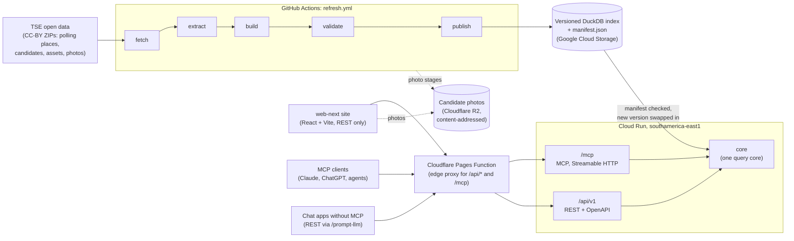

# Architecture

O meu voto answers a voter's questions from the Tribunal Superior Eleitoral (TSE) open data. A
scheduled pipeline turns the TSE files into one read-only DuckDB index; a single Python service
answers every question from that index, through MCP for AI assistants and REST for the web page
and for chat apps without a connector. Nothing at request time talks to the TSE or to a language
model.

The design documents behind this page are in Portuguese (`CONTEXT.md`,
[`domain-model.md`](domain-model.md), [`codebase-design.md`](codebase-design.md)); the decisions
are summarized in English in the [ADR table](#decisions) below.

## The system

### Pipeline: TSE files to a published index

The refresh runs in GitHub Actions ([`refresh.yml`](../.github/workflows/refresh.yml)), never
inside the service. Each stage is a subcommand of `python -m br_elections_mcp.pipeline` that
reads and writes files, so any one of them runs alone:

- **fetch** downloads the TSE ZIPs, one download per file per refresh, with `curl_cffi`
  impersonating a desktop browser because the TSE's WAF refuses plain HTTP clients (ADR 0003).
- **extract** takes the national CSV out of each ZIP.
- **build** writes `index.duckdb`. It drops CPF, voter title number, birth date, e-mail and
  asset free text, so they never reach the published index or any answer (ADR 0004, ADR 0009).
  Display casing of names and addresses is applied once here.
- **validate** runs the gates that block publication, including count stability against the
  manifest published before.
- **publish** uploads the index and its `manifest.json` (dataset generation timestamps, counts,
  election, SHA-256). Every version is kept under `versions/{version}/`; the current pair is
  written index first, manifest last, so rolling back is copying an older pair over it.

Candidate photos have their own stages in the same workflow: they are mirrored from the TSE
ZIPs to a public R2 bucket under keys named after the SHA-256 of each JPEG, the index records
the same digest, and a failed photo stage never blocks publishing a valid index (ADR 0013, ADR
0014, ADR 0015). Original TSE ZIPs and CSVs exist only in the refresh runner's temporary work
directory, which is removed at the end of the run. They are never committed or published. The
operational detail is in [`pipeline.md`](pipeline.md).

### Refresh cadence

The workflow has no GitHub `schedule:`: GitHub's cron fired hours late or skipped runs, so Cloud
Scheduler starts it through `workflow_dispatch` (Cloud Scheduler -> Workflows -> the workflow
on `main`; [`ops/README.md`](../ops/README.md), section 6). The times follow the cadence the TSE
declares for each dataset, about forty minutes after each publication so the CDN has the new
file (America/Sao_Paulo):

| Dataset | TSE publishes | Refresh starts |
|---|---|---|
| Polling places | daily at 06:25 | 07:05 |
| Candidates | 08:30, 12:30, 16:30 and 19:30 | 09:10, 13:10, 17:10 and 20:10 |

A run can also be started by hand. One refresh runs at a time.

### Service: one core, two doors

The service is one container on Cloud Run in southamerica-east1, at most one instance (ADR
0011). It opens the index read-only; there is no database server and no write path (ADR 0001).
After a query, a background check asks the bucket for the manifest at most once every 60
seconds and swaps a new version in without a restart; a version whose tables do not match its
manifest's counts is refused and the open one keeps serving.

All logic lives in `core`. Two thin adapters expose it (ADR 0002):

- **MCP** at `/mcp`, Streamable HTTP, stateless, built on the official `mcp` SDK. Seven
  read-only tools: `find_polling_place`, `search_polling_places`, `resolve_municipality`,
  `list_candidates`, `get_candidate`, `compare_candidates` and `election_info`.
- **REST** at `/api/v1`, JSON with an OpenAPI document at `/api/v1/openapi.json`.

Both are generated from the same pydantic models, so a tool's `outputSchema` and the OpenAPI
schema cannot drift. Every answer carries its source (the TSE dataset, file and generation
timestamp), its warnings (stale data, a changed polling place, a round not yet published)
and, when nothing matches, a reason instead of a guess. The contracts are in
[`codebase-design.md`](codebase-design.md), section 8.

### Edge and clients

The public domain is a Cloudflare Pages project. Its static assets are the `web-next/` site;
a Pages Function next to them (`web-next/functions/[[path]].js`) proxies only `/api/*` and
`/mcp` to Cloud Run, so the site, the REST API and the MCP endpoint share one origin (ADR 0005).
The function adds an edge secret header that the service requires, which makes the voter's
`CF-Connecting-IP` trustworthy for the per-IP rate limit (ADR 0010). It caches REST `GET`
answers for 60 seconds, except any request carrying the voter's coordinates, and answers the
idle MCP `GET` stream with `405`.

The clients are:

- **The site**, [omeuvoto.pages.dev](https://omeuvoto.pages.dev): comparison first, then the
  candidate profile, where to vote, places by city and election dates. It calls only the REST
  API ([`web-next/README.md`](../web-next/README.md)).
- **MCP clients** connected to `https://omeuvoto.pages.dev/mcp`.
- **Chat apps without MCP**, which read the setup text at
  [`/prompt-llm`](https://omeuvoto.pages.dev/prompt-llm) and call the public REST API from it.

Anonymous product telemetry goes to PostHog outside the request path; it carries the tool or
route, latency and outcome, never the caller's IP or any part of the request.

## Decisions

The ADRs are in [`adr/`](adr/), most in Portuguese; one English line each:

| ADR | Decision |
|---|---|
| [0001](adr/0001-embedded-duckdb-index.md) | The index is one embedded, read-only DuckDB file published to a bucket, instead of Postgres or Supabase. |
| [0002](adr/0002-mcp-streamable-http-official-sdk.md) | MCP over Streamable HTTP with the official `mcp` SDK, plus REST, both thin adapters over the same core. |
| [0003](adr/0003-curl-cffi-for-tse-downloads.md) | The pipeline downloads TSE files with `curl_cffi` browser impersonation, openly, while asking the TSE for a sanctioned route. |
| [0004](adr/0004-lgpd-candidate-data-minimization.md) | LGPD: candidate personal data with no product use (CPF, voter title, birth date, e-mail) is discarded at ingestion. |
| [0005](adr/0005-cloud-run-behind-cloudflare.md) | The service runs on Cloud Run in southamerica-east1 behind Cloudflare; the page on Pages, photos on R2. |
| [0006](adr/0006-jev-restricted-to-static-page.md) | Jev, a structured-answer model, may only classify the intent of the page's natural-language box, never inside the service. |
| [0007](adr/0007-product-recorte-mvp-then-comparator.md) | Finish the four voter questions first; a candidate comparator is the first scope beyond them. |
| [0008](adr/0008-candidate-comparator-v1-scope.md) | Comparator v1: 2 to 4 candidacies side by side, in ballot-number order, with no ranking, scores or recommendation. |
| [0009](adr/0009-titulo-transient-join-key-and-asset-free-text.md) | The voter title may only be an in-memory join key for asset growth; the free text of declared assets is dropped. |
| [0010](adr/0010-edge-secret-instead-of-cloudflare-ranges.md) | The origin trusts an edge secret instead of Cloudflare IP ranges, and `CF-Connecting-IP` only with a valid secret. |
| [0011](adr/0011-one-instance-budget-and-monitoring.md) | One Cloud Run instance at most, a R$ 150 monthly budget and monitoring kept as code. |
| [0012](adr/0012-polling-places-pagination.md) | Polling places are paginated with an offset over a stable, deterministic order. |
| [0013](adr/0013-content-addressed-photo-mirror.md) | Photo objects are named after their SHA-256 and the index records the digest, so a swapped photo is detectable. |
| [0014](adr/0014-photo-refresh-independent-of-index-publication.md) | Photo mirroring is time-bounded and can no longer block index publication; the first full load runs separately. |
| [0015](adr/0015-publication-aware-photo-cleanup.md) | Photos no served index references are deleted after publication, with a 48-hour grace and a deletion bound. |
